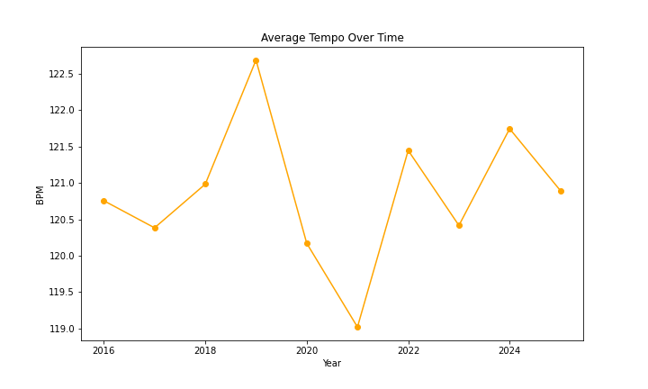
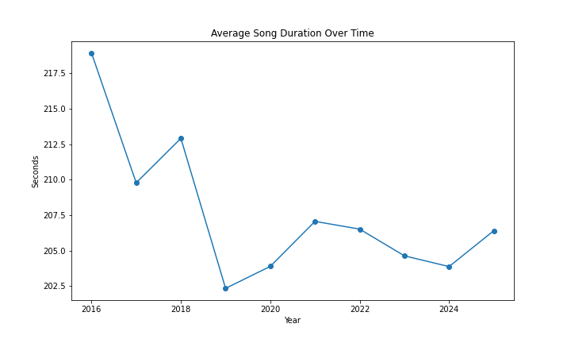
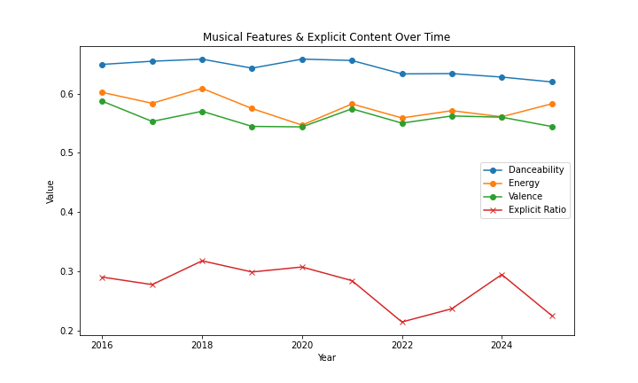
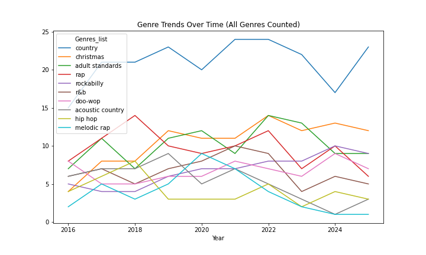
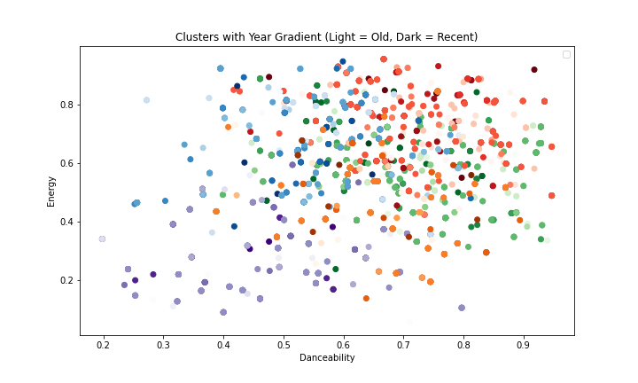
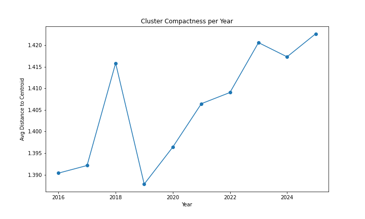
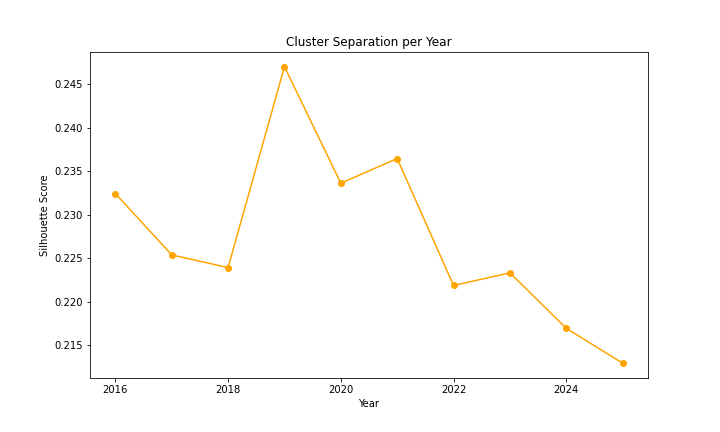
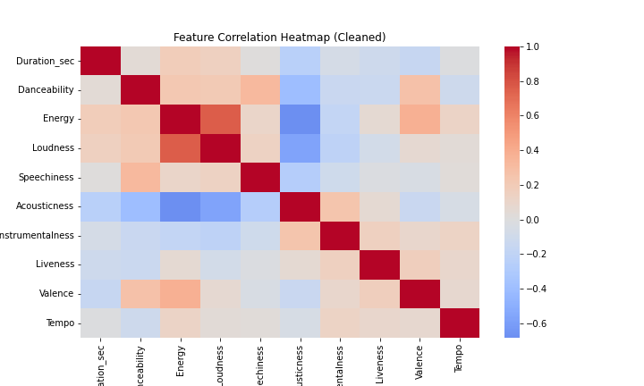

# Project of Data Visualization (COM-480)

| Student's name | SCIPER |
| -------------- | ------ |
|Hsieh Wei-En | 341271|
|Li An-Jie |424517 |
| Rohner Kenji	| 425036|

[Milestone 1](#milestone-1) • [Milestone 2](#milestone-2) • [Milestone 3](#milestone-3)

## Milestone 1 (20th March, 5pm)

**10% of the final grade**

This is a preliminary milestone to let you set up goals for your final project and assess the feasibility of your ideas.
Please, fill the following sections about your project.

*(max. 2000 characters per section)*

### Dataset

Our goal is to explore datasets that help analyze trends in popular music, while considering data quality and preprocessing effort. We focus on reliable public datasets and APIs rather than collecting raw data ourselves. 

We first looked at the Spotify Tracks Dataset on Kaggle, which provides useful audio features like energy and danceability. However, it is static and not focused on recent popular songs.
To better capture current pop music trends, we use two main sources:

1. [Billboard Hot 100 dataset](https://github.com/mhollingshead/billboard-hot-100)
    
    This dataset helps us identify popular songs. The Billboard Hot 100 dataset ranks the most popular songs in the U.S. based on streaming, radio play, and sales, and is widely used as a reliable measure of mainstream music popularity.

2. Music Features form Deezer and Spotify
    
    We use two tools (Deezer API and Exportify application) to get additional song information, such as artist, release date, and audio features (e.g., energy, danceability, loudness).

### Problematic

Music listeners today pursue immediate satisfaction.[1] The average song intro is much shorter than before, as artists need to capture listeners’ attention before they press “skip” on platforms like Spotify. Listeners prefer short, catchy elements, leading to songs whose choruses go viral on short-video platforms. Many producers now prioritize a strong hook over a full-length masterpiece.

Besides, some scholars argue that digital platforms have led music toward greater convergence[2], while others suggest the opposite view[3], with the internet enabling access to many niche genres and creating cultural fragmentation. This raises the question: are music styles forming distinct clusters, or are they becoming increasingly similar over time?

Therefore, we aim to visualize how pop music has changed over time for audiences curious about music trends. We focus on the following aspects:

1. Simpler song structure

    Use line charts to show changes in song length, intro length, and how quickly the chorus appears, to see if songs are getting straight to the “catchy part” faster.

2. Music genre groups

    Use network graphs or cluster plots to show how different genres and listeners are connected, and whether music styles are becoming more similar or staying diverse.

3. Musical features analysis

    Use charts (like heatmaps and line charts) to show changes in tempo, pitch range, chord patterns, and overall complexity, helping us understand how music sound has evolved.

4. Lyrics complexity (if possible)

    Use large language models (LLMs) to analyze lyrics and see how word choice and complexity have changed over time.

Some reference:
1.  Léveillé Gauvin, Hubert. "Drawing listener attention in popular music: Testing five musical features arising from the theory of attention economy." Musicae Scientiae 22.3 (2018): 291-304.
2. Serrà, Joan, et al. "Measuring the evolution of contemporary western popular music." Scientific reports 2.1 (2012): 521.
3. Anderson, Chris, Christopher Nissley, and Chris Anderson. "The long tail." Apr. 2006.

### Exploratory Data Analysis

See basic_statistics.ipynb for the code used to generate these charts:
Our dataset consists of 1,683 entries, each representing a song from the Billboard Hot 100 over the past decade (2016–2025). Each entry includes 16 attributes (Track Name, Artist Name(s), Release Date, Duration (ms), Explicit, Genres, Danceability, Energy, Loudness, Mode, Speechiness, Acousticness, Instrumentalness, Liveness, Valence, Tempo)

Some songs are currently missing from the dataset. We will adress this issue in the next milestone to improve completeness.

Structural trends show that average song duration decreases over time, while tempo remains stable, suggesting songs are shorter but maintain similar rhythmic intensity. Music features (danceability, energy, valence, and explicit content) remain relatively stable, indicating consistent emotional tone and production style.

Counting all genres, “country” is the most frequent, but no clear trends emerge yet. We will explore genre dynamics more deeply in later milestones.

We performed clustering using music features (danceability, energy, tempo, valence, and acousticness). The results show that, over time, the average distance of songs to their cluster centroids slightly increases, while the silhouette score decreases. This indicates that songs within each stylistic group are slightly less tightly grouped, and the clusters themselves are becoming closer to one another in feature space. Overall, this suggests a trend toward partial convergence of popular music styles, where different stylistic groups are increasingly similar while still maintaining some internal variation.

Finally, our heatmap aligns with general expectations about music production and validate the reliability of our dataset. For example, loudness is strongly positively correlated with energy, while showing a strong negative correlation with acousticness.

### Related work

Audio feature data from Spotify has been widely used in research on music trends, recommendation systems, and genre classification. Many studies apply machine learning to analyze listener behavior, song popularity, and audio features such as tempo, energy, and valence. However, most of this work focuses on predicting user preferences or classifying music, rather than examining how music itself evolves over time. At the same time, the Billboard Hot 100 is commonly used as a benchmark dataset for studying trends in popular music. It also enables comparisons across different time periods, helping researchers identify long-term shifts in the music industry.

Our project is inspired by modern listening habits shaped by short-form platforms such as TikTok, Instagram Reels, and YouTube Shorts. These platforms emphasize short, catchy “earworm” moments that quickly capture attention. This motivates us to study how quickly songs reach their most engaging parts. We also draw inspiration from data journalism and interactive media, aiming to present music trends in a clear, engaging, and visually intuitive way. In particular, we focus on providing a visual, data-driven analysis of how music has changed over time.

Our work differs in two main ways. First, we collect the most up-to-date data on Spotify. Second, the rapid rise of short-video platforms is a relatively recent trend that is likely influencing how music is produced and consumed. As a result, we expect to observe patterns that may differ from those identified in earlier research.

## Milestone 2 (17th April, 5pm)

**10% of the final grade**

## Milestone 3 (29th May, 5pm)

**80% of the final grade**

## Late policy

- < 24h: 80% of the grade for the milestone
- < 48h: 70% of the grade for the milestone

